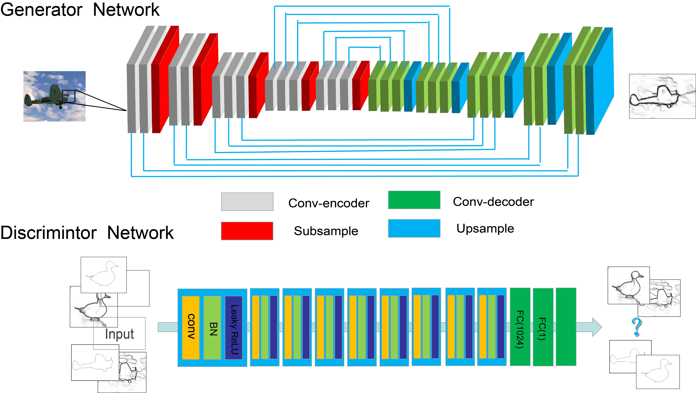
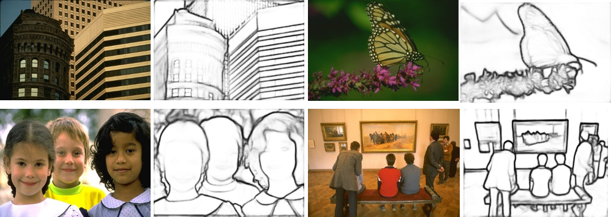

# ContourGAN
Tensorflow for ContourGAN: Image Contour Detection with Generative Adversarial Encoder-Decoder Networks

### Introduction
In this paper, we developed an encoder-decoder convolutional framework to extract images contour and generative adversarial models are also intriduced to produce high-quality edge information. Since traditional contour detection methods directly upsampled feature maps to images scale and the computed intermediate related informations are ignored. In addition, most of image-to-image models only take the loss between predicted results and ground truth into consideration. Based on these observations, we utilze all computed feature maps in enoder stage. For the more, generative adversarial models were introduced to further improve detection performance.In conclusion, our proposed contour detection methods (ContourGAN) contains two stages: the first stage is an encoder-decoder model whose weights updated from a binary cross entropy loss (BCE), fine-tuning from VGG16. In the second stage, we introduce a discriminator network which employ the corresponding ground truth and predicted contour results as input to discriminate them. Our The experiments results  achieve state-of-the-art performance on BSD500 datasets achieving ODS F-measure of 0.815, demonstrated that our proposed model based on adversarial and BCE loss extremely outperform others model.

## Framework

## Results on [BSDS500](https://www2.eecs.berkeley.edu/Research/Projects/CS/vision/grouping/resources.html)

## Prerequisites

- Python 2.7
- [TensorFlow==0.12.1+](https://www.tensorflow.org/)
- [TensorLayer==1.4+](https://github.com/zsdonghao/tensorlayer)

### Pretrained models
The pre-trained model for VGG16 is available [here](https://www.cs.toronto.edu/~frossard/vgg16/vgg16_weights.npz).

### Trained model with BSDS500

The trained model for Contour results without GAN model is available [here](http://pan.baidu.com/s/1eSiwFS2),pass word "vtrk".

##
### Acknowledgment

This code is based on HED and DCGAN . Thanks to the contributors of those.

    @inproceedings{xie2015holistically,
      title={Holistically-nested edge detection},
      author={Xie, Saining and Tu, Zhuowen},
      booktitle={Proceedings of the IEEE International Conference on Computer Vision},
      pages={1395--1403},
      year={2015}
    }
    @InProceedings{xie15hed,
      author = {"Xie, Saining and Tu, Zhuowen"},
      Title = {Holistically-Nested Edge Detection},
      Booktitle = "Proceedings of IEEE International Conference on Computer Vision",
      Year  = {2015},
    }

